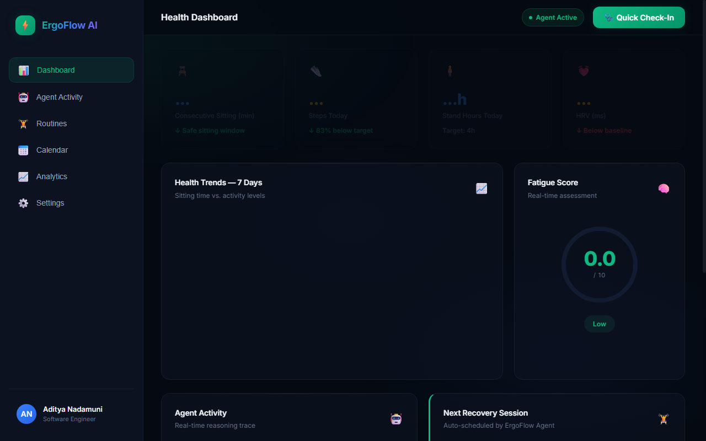
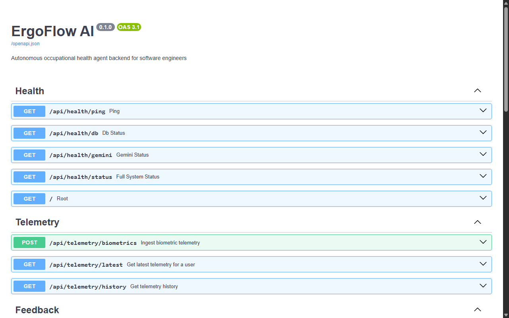
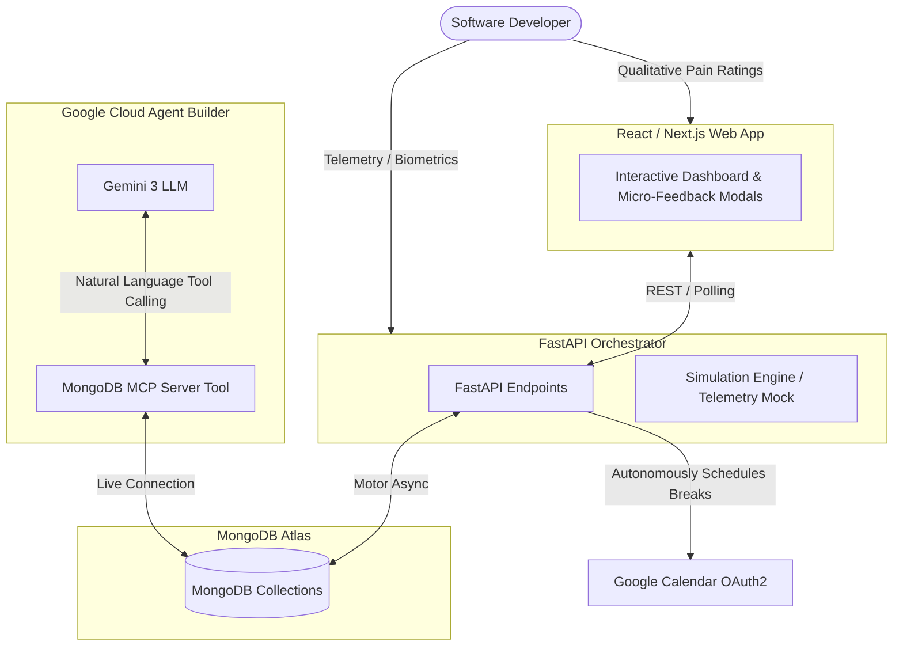

# 🪑 ErgoFlow AI — Autonomous Context-Aware Ergonomics Agent

> **Google Cloud Rapid Agent Hackathon (MongoDB Track)**  
> *Protecting developers from fatigue and physical strain through active, stateful cognitive calendar orchestration.*

---

## 🌟 Overview

**ErgoFlow AI** is a stateful, autonomous health orchestration agent designed specifically for software engineers. Desktop-bound professionals frequently suffer from repetitive strain injuries, poor posture, and physical fatigue due to uninterrupted focus sessions. 

Instead of acting as a passive timer-based alarm (which developers quickly dismiss), **ErgoFlow AI** continuously reasons over:
1. **Continuous Biometric Telemetry:** Active sitting minutes, HRV indicators, step counts, and caloric burn.
2. **Qualitative Micro-Feedback:** Rapid 1-click muscle, pain, and visual fatigue assessments.
3. **Calendar Flow:** Integrates directly with workflow calendars to autonomously schedule personalized, context-aware micro-recovery breaks (e.g., lumbar stretches, pec decompression, and eye-strain reliefs) directly into empty blocks.

---

## 📸 Demo Screenshots

Here is the functional interface of **ErgoFlow AI** running locally, seeded with high-fatigue workday telemetry and active autonomous agent calculations:

### Live Developer Health Dashboard (Next.js client)
Shows active step logs, HRV indicators, stand hour history, composite fatigue calculations, upcoming scheduled recovery blocks, and the real-time cognitive reasoning trace of the AI agent.


### Live Swagger API Documentation (FastAPI server)
The interactive FastAPI Swagger endpoint enables direct telemetry checks, feedback submission testing, and simulated workflow seeder runs.



---

## 🏗️ Architecture



---

## 🚀 Getting Started

### 1. Run the Backend (FastAPI)
1. Navigate to the backend directory:
   ```bash
   cd backend
   ```
2. Create and activate a Python virtual environment:
   ```bash
   python -m venv venv
   # On Windows:
   .\venv\Scripts\activate
   ```
3. Install dependencies:
   ```bash
   pip install -r requirements.txt
   ```
4. Copy and populate the local environment variables:
   ```bash
   cp .env.example .env
   ```
5. Run the server:
   ```bash
   python run.py
   ```
   *The server runs locally at `http://localhost:8000` with interactive Swagger docs at `/docs`.*

### 2. Run the Frontend (Next.js)
1. Navigate to the frontend directory:
   ```bash
   cd frontend
   ```
2. Install npm packages:
   ```bash
   npm install
   ```
3. Run the development server:
   ```bash
   npm run dev
   ```
   *The client dashboard opens locally at `http://localhost:3000`.*

---

## 🧠 Memory & AI Rules
This repository contains a dedicated `.clinerules` and `.cursorrules` definition enforcing that any AI agent working on this repository must read, update, and persist long-term context inside the `MEMORY.md` file located at the root of the workspace. This ensures seamless continuity of features.
