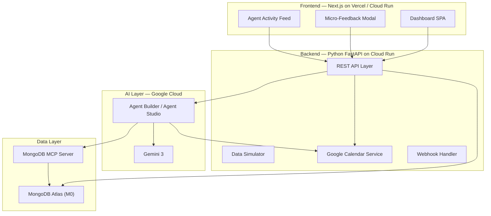

# ErgoFlow AI — Implementation Plan

**Hackathon**: Google Cloud Rapid Agent Hackathon (MongoDB Track)  
**Developer**: Solo, part-time (~40–50 hours over 2 weeks)  
**Deadline**: June 11, 2026, 2:00 PM PDT  
**Skill Profile**: Strong frontend, new to AI/agent development  

---

## User Review Required

> [!IMPORTANT]
> **Stack Change from IDEA.md**: Switching from Java/Spring Boot to **Python (FastAPI)** for the backend. This was agreed in our Q&A — FastAPI has native Google ADK support, faster iteration, and better AI ecosystem integration.

> [!WARNING]
> **Scope Reality Check**: You selected all 6 UI features. With ~40–50 hours solo, the plan below splits these into 3 tiers. **Tier 1 alone is a complete, demo-ready project.** Tiers 2 and 3 add polish and "wow factor" — pursue them only if Tier 1 is solid and stable.

> [!CAUTION]
> **Google Calendar OAuth**: Real calendar integration requires a Google Cloud OAuth consent screen and credentials setup. This can take 1–2 hours of configuration and must be done early. If you hit blockers, we'll fall back to simulated calendar events.

---

## Resolved Decisions

> [!NOTE]
> **Q1: Exercise Illustrations** — ✅ **Animated SVG/CSS stick figures**. Will implement text+icons in Tier 1, upgrade to animated SVGs in Tier 2.

> [!NOTE]
> **Q2: Demo Video Approach** — ✅ **Scripted + live hybrid**. Pre-seed compelling data states, then show live agent reasoning + calendar mutation in real-time.

> [!NOTE]
> **Q3: Project Name** — ✅ **ErgoFlow AI** confirmed. Ergo (ergonomics) + Flow (workflow) — clear, professional, demo-friendly.

---

## Architecture Overview



---

## Tech Stack

| Layer | Technology | Rationale |
|---|---|---|
| **Frontend** | Next.js 15 (App Router) | SSR, polished output, strong ecosystem |
| **Styling** | Vanilla CSS + CSS Variables | Full control over dark-mode wellness theme |
| **Charts** | Recharts or Chart.js | Lightweight, React-native charting |
| **Backend** | Python 3.12 + FastAPI | Fast iteration, native Google Cloud SDK support |
| **Database** | MongoDB Atlas (M0 free tier) | Hackathon partner track requirement |
| **AI Agent** | Google Cloud Agent Builder (Agent Studio) | Visual setup, MCP tool registration, matches judging criteria |
| **LLM** | Gemini 3 (via Agent Builder) | Hackathon requirement |
| **MCP** | MongoDB MCP Server (`mongodb-mcp-server`) | Partner Power requirement |
| **Calendar** | Google Calendar API (Python client) | Killer demo feature |
| **Deployment** | Google Cloud Run (primary) + Vercel (backup) | Dual deployment for reliability |
| **CI/CD** | GitHub Actions → Cloud Run + Vercel auto-deploy | Automated on push |

---

## Feature Tiers

### 🟢 Tier 1 — Demo-Critical (Week 1, ~25 hours)
*Complete this tier first. This alone is a submittable, winning-capable project.*

| # | Feature | Est. Hours | Judging Criteria Hit |
|---|---|---|---|
| 1.1 | Project scaffolding (Next.js + FastAPI + MongoDB Atlas) | 3h | — |
| 1.2 | MongoDB data model + seed data generator | 2h | Partner Power |
| 1.3 | Realistic data simulator (generates biometric + feedback data) | 2h | Beyond Chat |
| 1.4 | Google Cloud Agent Builder setup + Gemini 3 agent config | 3h | Multi-Step Planning |
| 1.5 | MongoDB MCP Server deployment + Agent tool registration | 2h | Partner Power |
| 1.6 | Agent reasoning loop: ingest data → detect fatigue → decide action | 3h | Multi-Step Planning |
| 1.7 | Google Calendar OAuth + event creation endpoint | 3h | Beyond Chat |
| 1.8 | Health trend dashboard (charts: sitting time, fatigue over time) | 3h | — |
| 1.9 | Micro-feedback modal (1-click sliders) | 2h | Beyond Chat |
| 1.10 | API integration: frontend ↔ backend ↔ agent | 2h | — |

**Tier 1 Total: ~25 hours** → A complete, functional agent that reasons, queries MongoDB via MCP, and schedules calendar events.

---

### 🟡 Tier 2 — Impressive Extras (Week 2, first half, ~12 hours)
*These features turn a "good" project into a "wow" demo.*

| # | Feature | Est. Hours | Impact |
|---|---|---|---|
| 2.1 | Live agent activity feed (real-time reasoning steps visible) | 3h | Judges see AI thinking |
| 2.2 | Agent reasoning trace panel (expandable, shows tool calls) | 3h | Technical depth |
| 2.3 | Routine detail view (generated exercises with icons/descriptions) | 3h | Visual completeness |
| 2.4 | Calendar sync status view (show scheduled events from agent) | 2h | End-to-end proof |
| 2.5 | Dark mode polish + micro-animations + responsive design | 1h | First impressions |

**Tier 2 Total: ~12 hours**

---

### 🔵 Tier 3 — Nice-to-Have (Week 2, second half, ~8 hours)
*Only if Tiers 1 and 2 are stable. These are differentiators.*

| # | Feature | Est. Hours | Impact |
|---|---|---|---|
| 3.1 | Animated exercise illustrations (CSS/SVG stick figures) | 3h | Visual wow |
| 3.2 | Agent evaluation/observability metrics (success rate, latency) | 2h | Production-grade impression |
| 3.3 | Multi-user simulation (show agent handling 2–3 different user profiles) | 2h | Scalability proof |
| 3.4 | Demo video recording + editing | 1h | Submission requirement |

**Tier 3 Total: ~8 hours**

---

## Proposed Changes

### Frontend — Next.js App

#### [NEW] `frontend/` directory

```
frontend/
├── app/
│   ├── layout.tsx              # Root layout with dark theme
│   ├── page.tsx                # Main dashboard page
│   ├── globals.css             # Design system (CSS variables, dark mode)
│   └── api/                    # Next.js API routes (proxy to FastAPI)
├── components/
│   ├── Dashboard/
│   │   ├── HealthTrendChart.tsx     # Recharts: sitting time, fatigue trends
│   │   ├── FatigueScoreCard.tsx     # Current fatigue summary card
│   │   └── CalendarSyncStatus.tsx   # Agent-scheduled events [Tier 2]
│   ├── Agent/
│   │   ├── AgentActivityFeed.tsx    # Live feed of agent actions [Tier 2]
│   │   └── ReasoningTrace.tsx       # Expandable reasoning panel [Tier 2]
│   ├── Feedback/
│   │   ├── MicroFeedbackModal.tsx   # 1-click sliders for pain/fatigue
│   │   └── FeedbackHistory.tsx      # Past feedback entries
│   ├── Routine/
│   │   ├── RoutineCard.tsx          # Exercise routine display [Tier 2]
│   │   └── ExerciseStep.tsx         # Individual exercise detail
│   └── common/
│       ├── Header.tsx
│       ├── Sidebar.tsx
│       └── GlassCard.tsx            # Reusable glassmorphism container
├── lib/
│   ├── api.ts                       # API client for FastAPI backend
│   └── types.ts                     # TypeScript type definitions
├── package.json
├── next.config.js
└── Dockerfile                       # Cloud Run deployment
```

**Design System** (CSS Variables):
```css
/* Wellness dark mode palette */
--bg-primary: #0a0f1a;
--bg-secondary: #111827;
--bg-card: rgba(17, 24, 39, 0.7);
--accent-health: #10b981;      /* Emerald green */
--accent-calm: #3b82f6;        /* Soft blue */
--accent-warning: #f59e0b;     /* Amber for fatigue alerts */
--accent-critical: #ef4444;    /* Red for high pain */
--text-primary: #f9fafb;
--text-secondary: #9ca3af;
--glass-border: rgba(255, 255, 255, 0.08);
--glass-bg: rgba(255, 255, 255, 0.04);
```

---

### Backend — Python FastAPI

#### [NEW] `backend/` directory

```
backend/
├── app/
│   ├── main.py                      # FastAPI app entry point
│   ├── config.py                    # Environment config (MongoDB URI, GCP creds)
│   ├── models/
│   │   ├── user.py                  # UserProfile Pydantic model
│   │   ├── telemetry.py             # BiometricTelemetry model
│   │   ├── feedback.py              # SubjectiveFeedback model
│   │   └── routine.py               # OrchestratedRoutine model
│   ├── routers/
│   │   ├── telemetry.py             # POST /api/telemetry/biometrics
│   │   ├── feedback.py              # POST /api/feedback/micro-prompt
│   │   ├── routines.py              # GET /api/agent/routines/next
│   │   ├── agent.py                 # POST /api/agent/evaluate (trigger agent)
│   │   └── calendar.py              # Calendar webhook + status endpoints
│   ├── services/
│   │   ├── mongodb_service.py       # Motor async MongoDB client
│   │   ├── calendar_service.py      # Google Calendar API integration
│   │   ├── agent_service.py         # Agent Builder API calls
│   │   └── simulator_service.py     # Realistic data generator
│   └── utils/
│       └── seed_data.py             # Initial seed data for demo
├── requirements.txt
├── Dockerfile                       # Cloud Run deployment
└── .env.example
```

**Key API Endpoints**:

| Method | Endpoint | Purpose | Tier |
|---|---|---|---|
| `POST` | `/api/telemetry/biometrics` | Ingest biometric data (real or simulated) | 1 |
| `POST` | `/api/feedback/micro-prompt` | Receive subjective feedback scores | 1 |
| `GET` | `/api/agent/routines/next` | Get next scheduled routine for user | 1 |
| `POST` | `/api/agent/evaluate` | Trigger agent evaluation loop | 1 |
| `GET` | `/api/agent/activity` | Get agent activity log (reasoning trace) | 2 |
| `GET` | `/api/calendar/events` | Get agent-scheduled calendar events | 1 |
| `POST` | `/api/simulator/generate` | Generate realistic mock data batch | 1 |

---

### AI Agent — Google Cloud Agent Builder

#### [NEW] Agent Configuration (Agent Studio)

**Agent Name**: `ergoflow-health-agent`  
**Model**: Gemini 3  
**Tools Registered**:
1. **MongoDB MCP Server** — queries `biometric_telemetry`, `subjective_feedback`, `orchestrated_routines`
2. **Google Calendar Tool** — creates/reads calendar events (via custom Cloud Function or API)

**System Prompt** (refined from IDEA.md):
```
# IDENTITY
You are ErgoFlow AI, an autonomous occupational health agent for software engineers.

# CAPABILITIES
You have access to two tools:
1. MongoDB MCP — query and write to the user's health database
2. Google Calendar — read availability and create recovery events

# EVALUATION PROTOCOL
When triggered for evaluation:
1. FETCH latest biometric_telemetry (last 2 hours) via MongoDB MCP
2. FETCH latest subjective_feedback (last 4 hours) via MongoDB MCP
3. ANALYZE: Compute a fatigue_score (0-10) based on:
   - consecutive_sitting_mins (weight: 0.3)
   - lower_back_stiffness + shoulder_tension (weight: 0.3)
   - steps_count_today relative to baseline (weight: 0.2)
   - mental_fatigue + eye_strain (weight: 0.2)
4. DECIDE: If fatigue_score >= 6, proceed to intervention
5. CALENDAR CHECK: Find first available 10-15 min window in next 2 hours
6. GENERATE: Create a tailored recovery protocol with 3-4 specific exercises
7. SCHEDULE: Create calendar event + write routine to orchestrated_routines collection
8. REPORT: Return a structured JSON with your reasoning, fatigue_score, and actions taken

# OUTPUT FORMAT
Always return structured JSON with:
{
  "fatigue_score": number,
  "reasoning": string[],
  "action_taken": "intervention_scheduled" | "no_action_needed",
  "routine": { ... } | null,
  "calendar_event": { ... } | null
}
```

---

### Data Layer — MongoDB Atlas

#### [NEW] MongoDB Atlas Setup

**Cluster**: M0 (free tier)  
**Database**: `ergoflow_db`  
**Collections**: (schemas match IDEA.md Section 3, with minor refinements)

1. `user_profiles` — user preferences and baselines
2. `biometric_telemetry` — time-series health data (indexed on `user_id` + `timestamp`)
3. `subjective_feedback` — qualitative micro-prompt scores
4. `orchestrated_routines` — AI-generated recovery protocols
5. `agent_activity_log` — [Tier 2] logs of agent reasoning steps for the activity feed

**Indexes**:
```
biometric_telemetry: { user_id: 1, timestamp: -1 }
subjective_feedback: { user_id: 1, timestamp: -1 }
orchestrated_routines: { user_id: 1, scheduled_timestamp: -1 }
agent_activity_log: { user_id: 1, created_at: -1 }
```

---

### Deployment

#### [NEW] `docker-compose.yml` (local development)
- Frontend (Next.js) on port 3000
- Backend (FastAPI) on port 8000
- MongoDB MCP Server connecting to Atlas

#### [NEW] `.github/workflows/deploy.yml`
- On push to `main` → build & deploy backend to Cloud Run
- Vercel auto-deploys frontend via GitHub integration

---

## Verification Plan

### Automated Tests
1. **Agent E2E Test**: Push high-fatigue data to MongoDB → trigger agent evaluation → verify calendar event created and routine stored
2. **API Tests**: `pytest` for all FastAPI endpoints with mock data
3. **Frontend Smoke Test**: `next build` succeeds, no TypeScript errors

### Manual Verification
1. **Demo Walkthrough** (critical path):
   - Open dashboard → see health trends
   - Click micro-feedback → submit high pain scores
   - Watch agent activity feed update in real-time
   - See new calendar event appear
   - View generated recovery routine
2. **Demo Video**: Screen-record the above flow with narration

---

## Demo Script (3-Minute Video)

| Time | Content |
|---|---|
| 0:00–0:30 | **Hook**: "Software engineers sit 10+ hours/day. Existing solutions are dumb timers. ErgoFlow AI is different." |
| 0:30–1:00 | **Show Dashboard**: Health trends, biometric data, fatigue scores over the past week |
| 1:00–1:30 | **Trigger the Agent**: Submit high fatigue scores via micro-feedback modal. Show the agent reasoning trace in real-time — "Analyzing data... Fatigue score 8.2... Checking calendar..." |
| 1:30–2:15 | **The Magic Moment**: Agent autonomously creates a Google Calendar event. Show the calendar updating. Display the tailored exercise routine with specific movements. |
| 2:15–2:45 | **Architecture Callout**: Brief overlay showing Gemini 3 → Agent Builder → MongoDB MCP → Calendar API flow |
| 2:45–3:00 | **Closing**: "ErgoFlow AI — the first autonomous health agent that acts, not just alerts." |

---

## Weekly Schedule

### Week 1 (May 22–28): Foundation + Core Agent
| Day | Tasks |
|---|---|
| Day 1-2 | Project scaffolding, MongoDB Atlas setup, seed data, design system CSS |
| Day 3-4 | FastAPI backend: endpoints, data models, simulator, Google Calendar OAuth |
| Day 5-6 | Google Cloud Agent Builder: agent creation, MongoDB MCP registration, system prompt |
| Day 7 | Frontend dashboard: health charts, micro-feedback modal, API integration |

### Week 2 (May 29–Jun 4): Polish + Extras + Demo
| Day | Tasks |
|---|---|
| Day 8-9 | Tier 2: Agent activity feed, reasoning trace panel, routine detail view |
| Day 10 | Tier 2: Calendar sync status, dark mode polish, animations |
| Day 11 | Cloud Run deployment, Vercel backup setup |
| Day 12 | End-to-end testing, bug fixes |
| Day 13 | Demo video recording |
| Day 14 | Buffer / Tier 3 features if ahead of schedule |

### Final Week (Jun 5–11): Submission
- Polish documentation (README, Devpost submission)
- Final demo video edit
- Submit before June 11, 2:00 PM PDT
